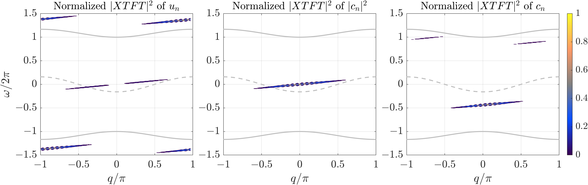

# ExactPolarobreathers
MATLAB code to compute and study spectral properties of numerically exact stationary and moving polarobreather solutions in a one-dimensional semi-classical crystal lattice model. Using the code and developed numerical algorithms, please cite 

Bajārs, J., Archilla, J.F.R.: *Splitting methods for semi-classical Hamiltonian dynamics of charge transfer in nonlinear lattices*. Mathematics **10**(19), 3460 (2022), [DOI:10.3390/math10193460](https://www.mdpi.com/2227-7390/10/19/3460).

File `ExactPolarobreathers_PureCode_WithoutData.zip` contains pure code without precomputed data and images.

      

    
   

This research has been financially supported by the specific support objective activity 1.1.1.2. “Post-doctoral Research Aid” of the Republic of Latvia (Project No. 1.1.1.2/VIAA/4/20/617 “Data-Driven Nonlinear Wave Modelling”), funded by the European Regional Development Fund (project id. N. 1.1.1.2/16/I/001).

#### Instructions to run the code
- To perform a numerical simulation, run the file `main.m`.
- Initial conditions and the choice of the numerical method are set in the same file `main.m`.
- All parameter values are defined in the file `Parameter_Values.m`.
- All variables are initialized in the file `Define_Variables.m`. 
- For convenience, all parameter values and variables are stored in structures: `parm` and `vars`, respectively.
- All functions and numerical methods can be found and are defined in the folder `Functions`.
- Optionally, simulation data and figures can be saved in the following folders: `SavedData` and `Figures`, respectively.
