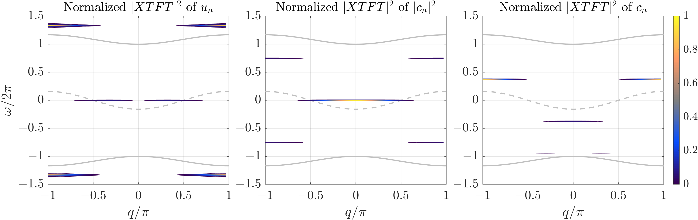

# ExactPolarobreathers
MATLAB code to compute and study spectral properties of numerically exact stationary and moving polarobreather solutions in a one-dimensional semi-classical crystal lattice model. Using the code and developed numerical algorithms, please cite Archilla, J.F.R., Bajārs, J.: *Spectral Properties of Exact Polarobreathers in Semiclassical Systems*. Axioms **12**(5), 437 (2023), [DOI: 10.3390/axioms12050437](https://www.mdpi.com/2075-1680/12/5/437).

File `ExactPolarobreathers_PureCode_WithoutData.zip` contains pure code without precomputed data and images.

      

    
   

This research has been financially supported by the specific support objective activity 1.1.1.2. “Post-doctoral Research Aid” of the Republic of Latvia (Project No. 1.1.1.2/VIAA/4/20/617 “Data-Driven Nonlinear Wave Modelling”), funded by the European Regional Development Fund (project id. N. 1.1.1.2/16/I/001).

#### Instructions to run the code
- To perform a test numerical simulation, run the file `main.m`. Initial conditions are set in the same file `main.m`.
- All parameter values are defined in the file `Parameter_Values.m`, whereas all variables are initialized in the file `Define_Variables.m`. 
- For convenience, all parameter values and variables are stored in structures: `parm` and `vars`, respectively.
- All functions can be found and are defined in the folder `Functions`.
- Simulation data and figures are saved in the following folders: `SavedData` and `Figures`, respectively.
- To obtain simulation data of approximate stationary polarobreather solution, run the following files: `Parameter_Values_SimDataXTFT_approx_stat.m` and `main_SimDataXTFT_approx_stat.m`.
- To obtain simulation data of approximate moving polarobreather solution, run the following files: `Parameter_Values_SimDataXTFT_approx_mov.m` and `main_SimDataXTFT_approx_mov.m`.
- Damped Gauss-Newton method is used to obtain numerically exact stationary and moving polarobreather solutions by running the files: `main_exact_solution_muGaussNewton_E0_stat.m` and `main_exact_solution_muGaussNewton_E0_mov.m`, respectively.
- To obtain numerical simulation data of exact stationary and moving polarobreather solutions, run the following files: `main_SimDataXTFT_exact_stat.m` and `main_SimDataXTFT_exact_mov.m`, respectively.
- Obtained simulation data is used to compute and study polarobreathers' spectral properties using the file `plot_XTFT_spectra.m`. 
